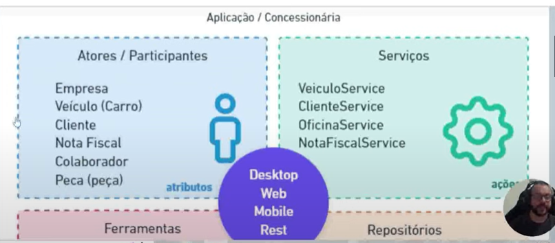
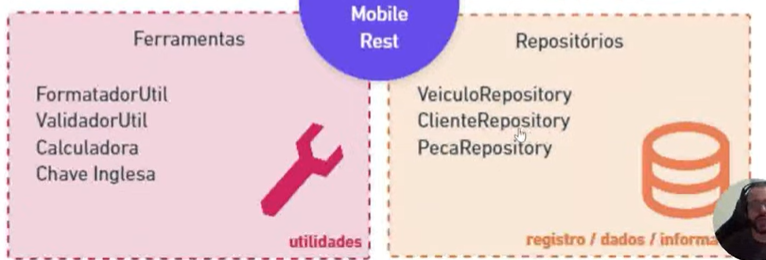

# Java POO
- POO 
- - Paradigma de programação baseada no conceito de "objetos", podem conter dados conhecidos como atributos e 
    procedimentos conhecimos como métodos.

- Classes
- - A estrutura que direciona a criação dos objetos de mesmo tipo.
- Identificador 
- - O propósito pela qual ela foi criada.
- Atributos (Características)
- - É toda informação que representa o estado do objeto.
- Métodos (comportamentos) 
- - É toda parte comportamental que um objeto dispõe.
- Instanciar (new) 
- - É o ato de criar um objeto a partir de estrutura definida em uma classe.

## Seguindo algumas convenções
- Classe de modelo (model): 
- - Sãoo classes que representam estrutura de domínio da aplicação, EX: Cliente, Pedido, Nota Fiscal.
- Classe de serviço (service):
- - Classes que contém regras de negócios e validação de nosso sistema.
- Classe de repositório (repository): 
- - Classes que contém uma integração com banco de dados.
- Classe de controle (controller):
- - Classes que possuem a finalidade de disponibilizar alguma comunicação externa à nossa aplicação, tipo http web 
    ou webservices.
- Classe utilitária (util) classe que contém recursos comuns à toda nossa aplicação.
- 
- 